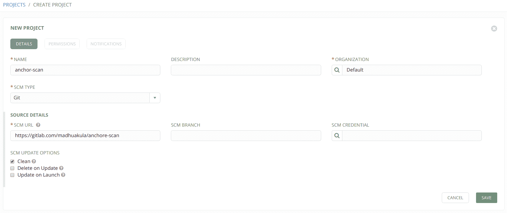
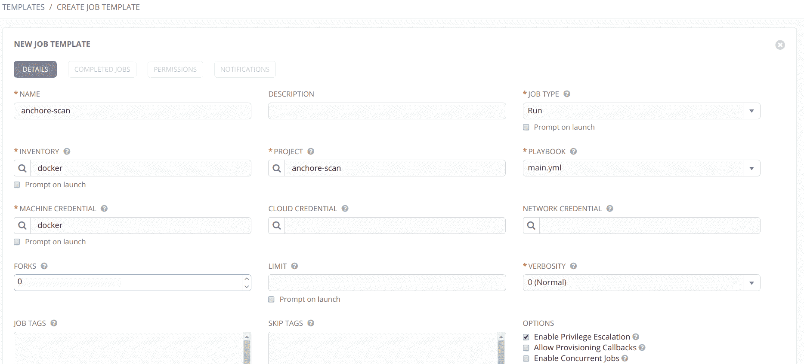
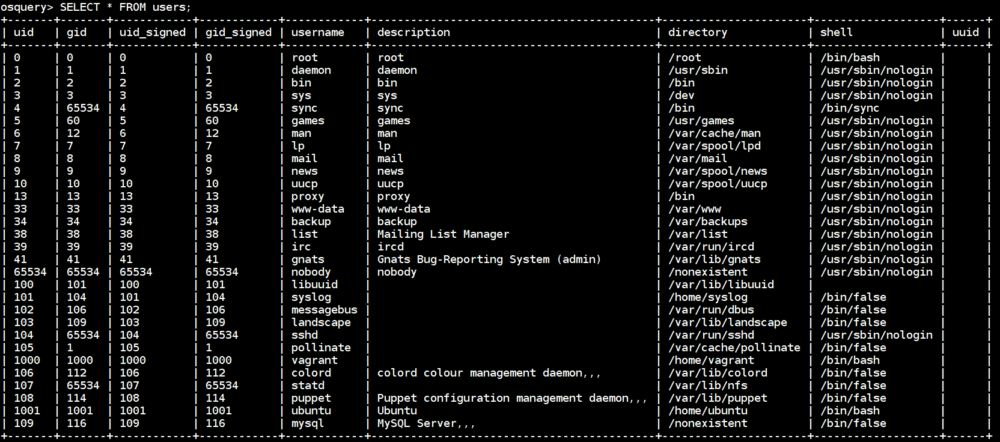
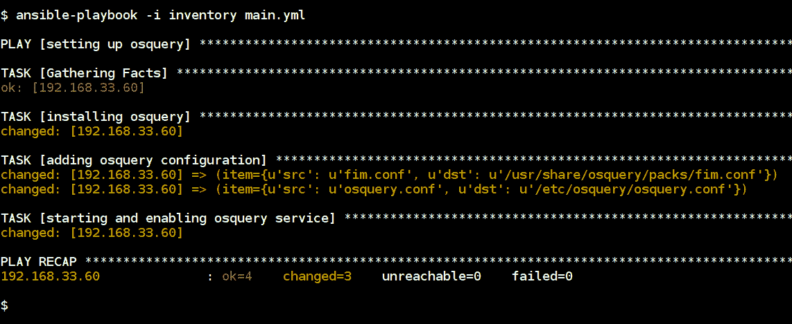

# 码头集装箱的连续安全扫描

Docker 容器是开发人员打包应用程序的新方式。容器的最佳特性是它们包含代码、运行时、系统库以及应用程序工作所需的所有设置。由于易于使用和部署，越来越多的应用程序被部署在容器中用于生产。

有了如此多的移动部件，我们有能力持续扫描 Docker 容器的安全问题变得非常必要。在这一章中，我们将探讨实现这一目标的各种方法。从使用 Ansible 调用的熟悉的 CIS 基准测试脚本开始，我们将继续讨论 clair-scanner，这是一个扫描现有漏洞的好工具，如果您需要，它可以与您现有的 CI/CD 工作流很好地集成。

在本章中，我们将详细探讨以下主题:

*   理解连续安全概念
*   使用 Ansible 自动化 Docker 容器的漏洞评估
*   为了 Docker 安全，使用 Ansible Tower 进行计划扫描
*   使用 Ansible Tower 对操作系统和内核安全性进行计划扫描
*   计划扫描文件完整性检查，使用 Ansible 进行主机级监控，以实现各种合规性计划

# 理解连续安全概念

从 DevOps 中涌现出来的关键方法之一是不可变基础设施的思想。这意味着每次需要更改运行时，无论是在应用程序代码还是配置中，都要重新构建和部署容器，并拆除现有的运行容器。

由于这允许可预测性、弹性，并简化了运行时的部署选择，因此许多运营团队都在朝着这个方向发展也就不足为奇了。随之而来的问题是，何时应对这些容器进行安全性和合规性测试。通过采用本章中讨论的连续安全扫描和监控过程，您可以自动化各种工作负载和工作流。

# 使用 Ansible 自动化 Docker 容器的漏洞评估

集装箱到处都是。让我们看看使用 Ansible 执行扫描和评估 Docker 容器和环境的一些技术和工具。

有许多不同的方法来评估集装箱的安全性。在本章中，我们将了解其中的一些，以及它们如何与 Ansible 一起使用:

| **工具** | **描述** |
| 码头工人工作台 | 基于配置项执行检查的安全外壳脚本 |
| 克莱尔 | 基于 CVE 数据库执行漏洞分析的工具 |
| 锚 | 执行安全评估和制定运行时策略决策的工具 |
| `vuls` | 带有 CVE、OVAL 数据库的无代理漏洞扫描程序 |
| `osquery` | 用于操作系统分析的操作系统检测框架，以进行 HIDS 类型的活动 |

# 安全码头工人工作台

**Docker Bench for Security** 是一个针对 Docker 容器环境执行多个检查的 shell 脚本。它将基于 CIS 基准提供更详细的安全配置视图。这个脚本支持大多数的 Unix 操作系统，因为它是基于 POSIX 2004 兼容的构建的。

更多刀具信息详见[https://github.com/docker/docker-bench-security](https://github.com/docker/docker-bench-security)。

以下是该脚本将执行的高级检查领域:

*   主机配置
*   Docker 守护程序配置和文件
*   Docker 容器图像
*   Docker 运行时
*   码头保安业务
*   码头工人群体配置

以下行动手册将针对 Docker 环境执行 Docker 工作台安全扫描，并返回详细报告:

```
- name: Docker bench security playbook
  hosts: docker
  remote_user: ubuntu
  become: yes

  tasks:
    - name: make sure git installed
      apt:
        name: git
        state: present

    - name: download the docker bench security
      git:
        repo: https://github.com/docker/docker-bench-security.git
        dest: /opt/docker-bench-security

    - name: running docker-bench-security scan
      command: docker-bench-security.sh -l /tmp/output.log
      args:
        chdir: /opt/docker-bench-security/

    - name: downloading report locally
      fetch:
        src: /tmp/output.log
        dest: "{{ playbook_dir }}/{{ inventory_hostname }}-docker-report-{{ ansible_date_time.date }}.log"
        flat: yes

    - name: report location
      debug:
        msg: "Report can be found at {{ playbook_dir }}/{{ inventory_hostname }}-docker-report-{{ ansible_date_time.date }}.log"</mark>
```

Docker bench 安全 Ansible 行动手册:


Docker bench security Ansible playbook in action

行动手册的输出将基于 CIS 基准下载并扫描容器，并将结果存储在`log`文件中，其输出可在此处看到:


Detailed Docker bench security analysis report

# 克莱尔

Clair 允许我们通过检查现有的漏洞数据库对容器执行静态漏洞分析。它允许我们使用克莱尔数据库对我们的 Docker 容器映像执行漏洞分析检查。更多关于克莱尔的细节可以在[https://github.com/coreos/clair](https://github.com/coreos/clair)找到。

设置 Clair 本身确实很难，使用带有 Docker 图像的 API 进行扫描会变得更加困难。克莱尔扫描仪来了，它使得使用 REST 应用编程接口设置和执行扫描变得非常简单。

Read more about clair-scanner at  [https://github.com/arminc/clair-scanner](https://github.com/arminc/clair-scanner).

Clair-scanner 可以根据特定事件触发对容器的简单扫描，以检查现有漏洞。此外，该报告可以转发给负责修复等工作的团队。

以下行动手册将设置执行克莱尔扫描所需的 Docker 容器和配置。它假设目标系统安装了 Docker 和所需的库:

```
- name: Clair Scanner Server Setup
  hosts: docker
  remote_user: ubuntu
  become: yes

  tasks:
    - name: setting up clair-db
      docker_container:
        name: clair_db
        image: arminc/clair-db
        exposed_ports:
          - 5432

    - name: setting up clair-local-scan
      docker_container:
        name: clair
        image: arminc/clair-local-scan:v2.0.1
        ports:
          - "6060:6060"
        links:
          - "clair_db:postgres"
```

下面的截图是使用 Ansible 执行带有 Docker 容器的克莱尔扫描仪设置


Setting up clair-scanner with Docker containers using Ansible It will take a while to download and setup the CVE database after playbook execution.

以下行动手册将用于运行 clair-scanner，通过向服务器发出 API 请求来对容器执行分析:

```
- name: Scanning containers using clair-scanner
  hosts: docker
  remote_user: ubuntu
  become: yes
  vars:
    image_to_scan: "debian:sid"   #container to scan for vulnerabilities
    clair_server: "http://192.168.1.10:6060"    #clair server api endpoint

  tasks:
    - name: downloading and setting up clair-scanner binary
      get_url:
        url: https://github.com/arminc/clair-scanner/releases/download/v6/clair-scanner_linux_amd64
        dest: /usr/local/bin/clair-scanner
        mode: 0755

    - name: scanning {{ image_to_scan }} container for vulnerabilities
      command: clair-scanner -r /tmp/{{ image_to_scan }}-scan-report.json -c {{ clair_server }} --ip 0.0.0.0 {{ image_to_scan }}
      register: scan_output
      ignore_errors: yes

    - name: downloading the report locally
      fetch:
        src: /tmp/{{ image_to_scan }}-scan-report.json
        dest: {{ playbook_dir }}/{{ image_to_scan }}-scan-report.json
        flat: yes
```

下面的截图是克莱尔扫描仪在为请求的码头工人图像行动。正如你所看到的致命错误，所以当它发现 docker 图像有任何问题时，它会返回错误，我们可以使用`ignore_errors`来处理它。


Clair-scanner execution in action

以下是运行 clair-scanner 的剧本输出和 JSON 格式的报告输出:


The output of the report includes vulnerability CVE and severity

# 为了 Docker 安全，使用 Ansible Tower 进行计划扫描

持续的安全流程都是关于计划、执行、测量和行动的循环:


The Deming Cycle from Wikimedia Commons

通过遵循标准清单和基准，并使用 Ansible 在容器上执行它们，我们可以检查安全问题并采取行动。Anchore 是一个集装箱分析和检测平台。

# 锚

Anchore 是对集装箱图像进行分析、检查和认证的最流行的工具和服务之一。它提供多种服务和平台进行设置，最稳定、最强大的方式就是使用 Anchore Engine 设置本地服务，可以通过 REST API 进行访问。在下面的文档中，我们将看到如何使用 Anchore Engine 设置服务，以及如何使用这个 REST API 对 Docker 容器执行连续的安全扫描和分析。

以下项目是 Anchore 可以执行的高级操作:

*   策略评估操作
*   图像操作
*   策略操作
*   注册表操作
*   订阅操作
*   系统操作

在[https://github.com/anchore/anchore-engine](https://github.com/anchore/anchore-engine)阅读更多关于 Anchore Engine 服务的信息。

# 锚定的引擎服务设置

以下行动手册将设置 Anchore Engine 服务，该服务包含引擎容器以及用于存储数据库信息的`postgres`。`admin_password`变量是访问 Anchore 的 REST API 的管理员用户密码:

```
- name: anchore server setup
  hosts: anchore
  become: yes
  vars:
    db_password: changeme
    admin_password: secretpassword

  tasks:
    - name: creating volumes
      file:
        path: "{{ item }}"
        recurse: yes
        state: directory

      with_items:
        - /root/aevolume/db
        - /root/aevolume/config

    - name: copying anchore-engine configuration
      template:
        src: config.yaml.j2
        dest: /root/aevolume/config/config.yaml

    - name: starting anchore-db container
      docker_container:
        name: anchore-db
        image: postgres:9
        volumes:
          - "/root/aevolume/db/:/var/lib/postgresql/data/pgdata/"
        env:
          POSTGRES_PASSWORD: "{{ db_password }}"
          PGDATA: "/var/lib/postgresql/data/pgdata/"

    - name: starting anchore-engine container
      docker_container:
        name: anchore-engine
        image: anchore/anchore-engine
        ports:
          - 8228:8228
          - 8338:8338
        volumes:
          - "/root/aevolume/config/config.yaml:/config/config.yaml:ro"
          - "/var/run/docker.sock:/var/run/docker.sock:ro"
        links:
          - anchore-db:anchore-db
```

以下截图是 Anchore 引擎服务设置的 Ansible 行动手册执行情况:


Anchore Engine service setup using Ansible playbook

# 锚定 cli 扫描仪

现在我们有了带有访问细节的 Anchore Engine 服务 REST API，我们可以使用它来执行对任何主机中的容器图像的扫描。以下步骤是 Ansible Tower 设置，用于对容器映像执行漏洞连续扫描。

扫描容器图像的行动手册如下所示:

```
- name: anchore-cli scan
  hosts: anchore
  become: yes
  vars:
    scan_image_name: "docker.io/library/ubuntu:latest"
    anchore_vars:
      ANCHORE_CLI_URL: http://localhost:8228/v1
      ANCHORE_CLI_USER: admin
      ANCHORE_CLI_PASS: secretpassword

  tasks:
    - name: installing anchore-cli
      pip:
        name: "{{ item }}"

      with_items:
        - anchorecli
        - pyyaml

    - name: downloading image
      docker_image: 
        name: "{{ scan_image_name }}"

    - name: adding image for analysis
      command: "anchore-cli image add {{ scan_image_name }}"
      environment: "{{anchore_vars}}"

    - name: wait for analysis to compelte
      command: "anchore-cli image content {{ scan_image_name }} os"
      register: analysis
      until: analysis.rc != 1
      retries: 10
      delay: 30
      ignore_errors: yes
      environment: "{{anchore_vars}}"

    - name: vulnerabilities results
      command: "anchore-cli image vuln {{ scan_image_name }} os"
      register: vuln_output
      environment: "{{anchore_vars}}"

    - name: "vulnerabilities in {{ scan_image_name }}"
      debug:
        msg: "{{ vuln_output.stdout_lines }}"
```

The options to perform  `anchore-cli` can be customized as required, please refer to the documentation at [https://github.com/anchore/anchore-cli](https://github.com/anchore/anchore-cli).

现在，我们必须在 Ansible Tower 中创建新项目来添加行动手册。然后，我们可以从版本控制中选择行动手册来源，或带有详细信息的所需来源:



然后，我们必须创建一个新的作业模板，为使用 Ansible Tower 执行行动手册提供选项:



我们也可以通过 Ansible Tower UI 传递变量。如您所见，我们正在传递一些秘密，我们将了解如何利用 Ansible Vault 安全地存储和使用这些秘密:


我们还可以根据需要安排该行动手册每周或每月运行一次。还要注意，这可以基于用例进行定制:


然后，我们还可以通过启动作业来执行按需扫描。以下截图是 CVE 详细信息和易受攻击包列表中`ubuntu:latest` Docker 映像漏洞的参考:


# 使用 Ansible Tower 对操作系统和内核安全性进行计划扫描

持续的安全扫描要求我们在像 Ansible Tower 这样的软件中进行管理。虽然大多数讨论的工具可用于扫描和维护安全基准，但我们应该考虑事件响应和威胁检测工作流的整个过程:

1.  准备
2.  检测和分析
3.  遏制、根除和恢复
4.  事故后活动

安装所有这些扫描仪是我们的准备工作。使用这些扫描仪的输出给了我们检测和分析的能力。遏制和恢复都超出了这些工具的范围。对于恢复过程和事件后活动，您可能希望考虑可以丢弃当前基础架构并按原样重新创建的行动手册。

作为我们准备工作的一部分，熟悉以下术语可能会有所帮助，因为您会看到它们在漏洞扫描器和漏洞管理工具的世界中反复使用:

| **期限** | **完整形式(如果有)** | **术语描述** |
| CVE | 常见漏洞和暴露 | 这是一个网络安全漏洞标识符列表。用法通常包括 CVE 身份证。 |
| 卵形的 | 开放漏洞和评估语言 | 一种用于发现和命名计算机系统中的漏洞和配置问题的语言。 |
| CWE | 常见弱点列举 | 软件安全弱点的常见列表。 |
| NVD | 国家脆弱性数据库 | 一个美国政府漏洞管理数据库，以 XML 格式提供给公众使用。 |

# vuls–漏洞扫描程序

**Vuls** 是一款用 golang 编写的无代理扫描仪。它支持不同种类的 Linux 操作系统。它执行完整的端到端安全系统管理任务，如扫描安全漏洞和安全软件更新。它分析系统所需的安全漏洞，根据 CVE 评分执行安全风险分析，通过 Slack 和电子邮件发送通知，还提供带有历史数据的简单网络报告。

Read more about vuls at [https://github.com/future-architect/vuls](https://github.com/future-architect/vuls).

# Vuls 设置行动手册

以下剧本用于在 Ubuntu 16.04 系统中使用 Docker 容器设置`vuls`。以下行动手册假设您已经安装了 docker 和所需的软件包。

剧本主要有两个使用 Docker 容器设置`vuls`的角色。

*   `vuls_containers_download`
*   `vuls_database_download`

```
- name: setting up vuls using docker containers
  hosts: vuls
  become: yes

  roles:
    - vuls_containers_download
    - vuls_database_download
```

使用`docker_image`模块在本地拉动码头工人集装箱:

```
- name: pulling containers locally
  docker_image:
    name: "{{ item }}"
    pull: yes

  with_items:
    - vuls/go-cve-dictionary
    - vuls/goval-dictionary
    - vuls/vuls
```

然后下载所需操作系统和发行版本的 CVE 和 OVAL 数据库:

```
- name: fetching NVD database locally
  docker_container:
    name: "cve-{{ item }}"
    image: vuls/go-cve-dictionary
    auto_remove: yes
    interactive: yes
    state: started
    command: fetchnvd -years "{{ item }}"
    volumes:
      - "{{ vuls_data_directory }}:/vuls"
      - "{{ vuls_data_directory }}/go-cve-dictionary-log:/var/log/vuls"
  with_sequence: start=2002 end="{{ nvd_database_years }}"

- name: fetching redhat oval data
  docker_container:
    name: "redhat-oval-{{ item }}"
    image: vuls/goval-dictionary
    auto_remove: yes
    interactive: yes
    state: started
    command: fetch-redhat "{{ item }}"
    volumes:
      - "{{ vuls_data_directory }}:/vuls"
      - "{{ vuls_data_directory }}/goval-dictionary-log:/var/log/vuls"
  with_items: "{{ redhat_oval_versions }}"

- name: fetching ubuntu oval data
  docker_container:
    name: "ubuntu-oval-{{ item }}"
    image: vuls/goval-dictionary
    auto_remove: yes
    interactive: yes
    state: started
    command: "fetch-ubuntu {{ item }}"
    volumes:
      - "{{ vuls_data_directory }}:/vuls"
      - "{{ vuls_data_directory }}/goval-dictionary-log:/var/log/vuls"
  with_items: "{{ ubuntu_oval_versions }}"
```

全局变量文件如下所示。我们可以增加更多的`redhat_oval_versions`，比如`5`。`nvd_database_years`将在 2017 年底之前下载 CVE 数据库:

```
vuls_data_directory: "/vuls_data"
nvd_database_years: 2017
redhat_oval_versions:
  - 6
  - 7
ubuntu_oval_versions:
  - 12
  - 14
  - 16
```

以下截图是针对 vuls 设置的 Ansible 行动手册执行情况:


Vuls setup playbook in action

# Vuls 扫描行动手册

现在，是时候使用`vuls` Docker 容器执行扫描和报告了。以下行动手册包含对虚拟机和容器执行`vuls`扫描的简单步骤，并将报告发送给 slack 和 web:

```
- name: scanning and reporting using vuls
  hosts: vuls
  become: yes
  vars:
    vuls_data_directory: "/vuls_data"
    slack_web_hook_url: https://hooks.slack.com/services/XXXXXXX/XXXXXXXXXXXXXXXXXXXXX
    slack_channel: "#vuls"
    slack_emoji: ":ghost:"
    server_to_scan: 192.168.33.80
    server_username: vagrant
    server_key_file_name: 192-168-33-80

  tasks:
    - name: copying configuraiton file and ssh keys
      template:
        src: "{{ item.src }}"
        dest: "{{ item.dst }}"
        mode: 0400

      with_items:
         - { src: 'config.toml', dst: '/root/config.toml' }
         - { src: '192-168-33-80', dst: '/root/.ssh/192-168-33-80' } 

    - name: running config test
      docker_container:
        name: configtest
        image: vuls/vuls
        auto_remove: yes
        interactive: yes
        state: started
        command: configtest -config=/root/config.toml
        volumes:
          - "/root/.ssh:/root/.ssh:ro"
          - "{{ vuls_data_directory }}:/vuls"
          - "{{ vuls_data_directory }}/vuls-log:/var/log/vuls"
          - "/root/config.toml:/root/config.toml:ro"

    - name: running vuls scanner
      docker_container:
        name: vulsscan
        image: vuls/vuls
        auto_remove: yes
        interactive: yes
        state: started
        command: scan -config=/root/config.toml
        volumes:
          - "/root/.ssh:/root/.ssh:ro"
          - "{{ vuls_data_directory }}:/vuls"
          - "{{ vuls_data_directory }}/vuls-log:/var/log/vuls"
          - "/root/config.toml:/root/config.toml:ro"
          - "/etc/localtime:/etc/localtime:ro"
        env:
          TZ: "Asia/Kolkata"

    - name: sending slack report
      docker_container:
        name: vulsreport
        image: vuls/vuls
        auto_remove: yes
        interactive: yes
        state: started
        command: report -cvedb-path=/vuls/cve.sqlite3 -ovaldb-path=/vuls/oval.sqlite3 --to-slack -config=/root/config.toml
        volumes:
          - "/root/.ssh:/root/.ssh:ro"
          - "{{ vuls_data_directory }}:/vuls"
          - "{{ vuls_data_directory }}/vuls-log:/var/log/vuls"
          - "/root/config.toml:/root/config.toml:ro"
          - "/etc/localtime:/etc/localtime:ro"

    - name: vuls webui report
      docker_container:
        name: vulswebui
        image: vuls/vulsrepo
        interactive: yes
        volumes:
          - "{{ vuls_data_directory }}:/vuls"
        ports:
          - "80:5111"
```

以下文件是`vuls`进行扫描的配置文件。这保存了松弛警报的配置以及执行扫描的服务器。这可以根据需要使用`vuls`文档进行非常有效的配置:

```
[slack]
hookURL = "{{ slack_web_hook_url}}"
channel = "{{ slack_channel }}"
iconEmoji = "{{ slack_emoji }}"

[servers]

[servers.{{ server_key_file_name }}]
host = "{{ server_to_scan }}"
user = "{{ server_username }}"
keyPath = "/root/.ssh/{{ server_key_file_name }}"
```

以下截图是正在运行的漏洞扫描的 Ansible 行动手册执行情况:


Vuls scanning playbook in action

一旦报告容器已经执行，基于配置选项，`vuls`将通知相应的松弛通道问题:


我们也可以访问`vuls`服务器 IP 地址的 web UI 界面，以表格和可移植的格式查看详细结果。这对于大规模管理大量服务器和补丁非常有用:


我们还可以通过深入研究报告中的问题、严重性、操作系统等来深入了解:


这可以作为基础架构代码成为 CI/CD 生命周期的一部分，然后我们可以使用 Ansible Tower 或 Jenkins 将其作为计划扫描运行。

# 针对文件完整性检查的计划扫描，使用 Ansible 进行主机级监控，用于各种合规性计划

使用 Ansible 在主机上执行命令的众多优势之一是能够获取内部系统信息，例如:

*   文件哈希
*   网络连接
*   正在运行的进程列表

它可以充当轻量级的**基于主机的入侵检测系统** ( **HIDS** )。虽然在许多情况下，这可能不会消除专门构建的 HIDS 的情况，但我们可以使用脸书的`osquery`和 Ansible 等工具执行相同类型的安全任务。

# 奥斯克里

`osquery`是脸书用 C++编写的操作系统插装框架，支持 Windows、Linux、OS X (macOS)等操作系统。它提供了一个使用类似 SQL 的语法查询操作系统的接口。通过使用它，我们可以执行低级活动，例如运行进程、内核配置、网络连接和文件完整性检查。总的来说，它就像一个基于主机的入侵检测系统 ( **HIDS** )端点安全。它提供`osquery`即服务、系统交互外壳等等。因此，我们可以使用它来执行集中监控和安全管理解决方案。更多关于`osquery`的信息，请访问[。](https://osquery.io)

以下是`osquery`外观的高级概述:



osquery getting a list of users with groups and other information using a SQL query

下面的行动手册是在您的 Linux 服务器中设置和配置`osquery`代理，以监控和查找漏洞、文件完整性监控和许多其他合规性活动，然后记录它们以发送到集中式日志监控系统:

```
- name: setting up osquery
  hosts: linuxservers
  become: yes

  tasks:
    - name: installing osquery
      apt:
        deb: https://pkg.osquery.io/deb/osquery_2.10.2_1.linux.amd64.deb
        update_cache: yes

    - name: adding osquery configuration
      template:
        src: "{{ item.src }}"
        dest: "{{ item.dst }}"

      with_items:
        - { src: fim.conf, dst: /usr/share/osquery/packs/fim.conf }
        - { src: osquery.conf, dst: /etc/osquery/osquery.conf }

    - name: starting and enabling osquery service
```

```
      service:
        name: osqueryd
        state: started
        enabled: yes
```

以下`fim.conf`代码片段是文件完整性监控包，它每 300 秒监控一次`/home`、`/etc`和`/tmp`目录中的文件事件。它使用**安全哈希算法** ( **SHA** )校验和来验证更改。这可用于查明攻击者是否添加了他们自己的 SSH 密钥或针对系统配置更改审核日志更改，以实现合规性和其他活动:

```
{
  "queries": {
    "file_events": {
      "query": "select * from file_events;",
      "removed": false,
      "interval": 300
    }
  },
  "file_paths": {
    "homes": [
      "/root/.ssh/%%",
      "/home/%/.ssh/%%"
    ],
      "etc": [
      "/etc/%%"
    ],
      "home": [
      "/home/%%"
    ],
      "tmp": [
      "/tmp/%%"
    ]
  }
}
```

`osquery`守护程序使用以下配置根据指定的选项、包和自定义查询执行检查和监控。我们还使用不同的包(包含多个查询)来寻找不同的监控和配置检查。

`osquery`, by default, has multiple packs for incident response, vulnerability management, compliance, rootkit, hardware monitoring, and so on. Read more at [https://osquery.io/schema/packs](https://osquery.io/schema/packs).

下面的代码片段是`osquery`服务配置。这可以通过`osquery`服务根据需要进行修改以进行监控和记录:

```
{
  "options": {
    "config_plugin": "filesystem",
    "logger_plugin": "filesystem",
    "logger_path": "/var/log/osquery",
    "disable_logging": "false",
    "log_result_events": "true",
    "schedule_splay_percent": "10",
    "pidfile": "/var/osquery/osquery.pidfile",
    "events_expiry": "3600",
    "database_path": "/var/osquery/osquery.db",
    "verbose": "false",
    "worker_threads": "2",
    "enable_monitor": "true",
    "disable_events": "false",
    "disable_audit": "false",
    "audit_allow_config": "true",
    "host_identifier": "hostname",
    "enable_syslog": "true",
    "audit_allow_sockets": "true",
    "schedule_default_interval": "3600" 
  },
  "schedule": {
    "crontab": {
      "query": "SELECT * FROM crontab;",
      "interval": 300
    },
    "system_profile": {
      "query": "SELECT * FROM osquery_schedule;"
    }, 
    "system_info": {
      "query": "SELECT hostname, cpu_brand, physical_memory FROM system_info;",
      "interval": 3600
    }
  },
  "decorators": {
    "load": [
      "SELECT uuid AS host_uuid FROM system_info;",
      "SELECT user AS username FROM logged_in_users ORDER BY time DESC LIMIT 1;"
    ]
  },
  "packs": {
     "fim": "/usr/share/osquery/packs/fim.conf",
     "osquery-monitoring": "/usr/share/osquery/packs/osquery-monitoring.conf",
     "incident-response": "/usr/share/osquery/packs/incident-response.conf",
     "it-compliance": "/usr/share/osquery/packs/it-compliance.conf",
     "vuln-management": "/usr/share/osquery/packs/vuln-management.conf"
  }
}
```

The reference tutorial can be followed at [https://www.digitalocean.com/community/tutorials/how-to-monitor-your-system-security-with-osquery-on-ubuntu-16-04](https://www.digitalocean.com/community/tutorials/how-to-monitor-your-system-security-with-osquery-on-ubuntu-16-04).

可以执行剧本在 Linux 服务器中设置`osquery`配置，以设置和记录由`osquery`代理生成的事件:



osquery setup playbook in action

目标不仅仅是设置`osquery`，我们可以使用我们的弹性堆栈使用日志来构建一个集中的实时监控系统。我们可以使用 Filebeat 代理将这些日志转发到我们的 Elastic 堆栈，我们可以查看它们并构建一个集中的仪表板来进行警报和监控。

以下是`osquery`生成的日志示例，我们可以看到`authorized_keys`文件在 2017 年 11 月 22 日 23:59:21.000 被 Ubuntu 用户修改:


这种想法可以扩展到通过对已知操作使用自动化的 Ansible 行动手册来采取针对攻击的行动来构建一些自动化防御。

世界正朝着容器的方向发展，这种监控让我们看到了底层的东西，比如内核安全检查和主机级的文件完整性检查。当攻击者试图绕过容器并访问主机以提升权限时，我们可以使用这种设置来检测和防御它们。

# 摘要

容器正在迅速改变开发人员和运营团队的世界。变革的速度正在加快，在这个新世界中，安全自动化开始扮演前沿和中心的角色。通过利用我们对使用 Ansible 编写一个接一个的命令脚本的知识，以及优秀的工具，如 Archore 和`osquery`，我们可以测量、分析和基准测试我们的容器的安全性。这使我们能够构建端到端的自动过程来保护、扫描和补救容器。

在下一章中，我们将看一个安全自动化的专门用例。我们将研究如何通过自动化恶意软件分析的某些部分来改进围绕恶意软件分析的任务。我们将特别关注集成布谷鸟沙盒的轻量级动态分析工作流，布谷鸟沙盒是目前最流行的恶意软件分析工具之一。