# 九、用于取证收集和恶意软件分析的自动化实验室设置

恶意软件是安全社区面临的最大挑战之一。它影响着每一个与信息系统互动的人。尽管在操作系统中保护计算机免受恶意软件侵害需要付出巨大努力，但恶意软件防御的一大部分工作是了解它们来自哪里以及它们有什么能力。

这是 Ansible 可以用于自动化和支持进行恶意软件分析的专家的部分。在这一章中，我们将看看各种工作流，这些工作流都是为了分类，使用像布谷鸟沙盒这样的工具分析恶意软件，等等。此外，我们将考虑为隔离环境的实验室以及取证工件的安全备份收集和存储创建 Ansible 行动手册。

# 为隔离环境的实验室创建可行的行动手册

我们将从使用病毒总量开始，然后在一个隔离的网络中使用一个 Windows 虚拟机进入布谷鸟。恶意软件分析的另一个重要方面是使用**恶意软件信息共享平台** ( **MISP** )协作和共享威胁的能力。我们还设置了 Viper(二进制管理和分析框架)来执行分析。

# 收集文件和域恶意软件识别和分类

恶意软件分析的初始阶段之一是识别和分类。最流行的来源是使用病毒总量扫描并获得恶意软件样本、域信息等的结果。它有一个非常丰富的应用编程接口，许多人已经编写了定制的应用，利用应用编程接口来执行自动扫描，使用应用编程接口密钥来识别恶意软件类型。下面的例子是在系统中设置病毒总量工具，根据病毒总量应用编程接口扫描恶意软件样本，并识别它是否真的是恶意软件。它通常使用 60 多种防病毒扫描程序和工具进行检查，并提供详细信息。

# 病毒总应用编程接口工具设置

以下行动手册将设置病毒总量应用编程接口工具([https://github.com/doomedraven/VirusTotalApi](https://github.com/doomedraven/VirusTotalApi))，该工具在病毒总量页面本身中得到官方支持:

```
- name: setting up VirusTotal
  hosts: malware
  remote_user: ubuntu
  become: yes

  tasks:
    - name: installing pip
      apt:
        name: "{{ item }}"

      with_items:
        - python-pip
        - unzip

    - name: checking if vt already exists
      stat:
        path: /usr/local/bin/vt
      register: vt_status

    - name: downloading VirusTotal api tool repo
      unarchive:
        src: "https://github.com/doomedraven/VirusTotalApi/archive/master.zip"
        dest: /tmp/
        remote_src: yes
      when: vt_status.stat.exists == False 

    - name: installing the dependencies
      pip:
        requirements: /tmp/VirusTotalApi-master/requirements.txt
      when: vt_status.stat.exists == False 

    - name: installing vt
      command: python /tmp/VirusTotalApi-master/setup.py install
      when: vt_status.stat.exists == False
```

剧本执行将下载存储库并设置病毒总应用编程接口工具，这将使我们为扫描恶意软件样本做好准备:

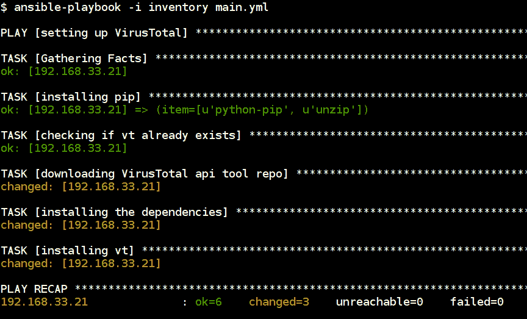

# 病毒总应用编程接口扫描恶意软件样本

一旦我们准备好设置，就像使用 Ansible 剧本扫描恶意软件样本列表一样简单。下面的剧本将找到本地恶意软件样本并将其复制到远程系统，然后递归扫描并返回结果。扫描完成后，将从远程系统中移除样本:

```
- name: scanning file in VirusTotal
  hosts: malware
  remote_user: ubuntu
  vars:
    vt_api_key: XXXXXXXXXXXXXXXXXXXXXXXXXXXXXXXXX #use Ansible-vault
    vt_api_type: public # public/private
    vt_intelligence_access: False # True/False
    files_in_local_system: /tmp/samples/
    files_in_remote_system: /tmp/sample-file/

  tasks:
    - name: creating samples directory
      file:
        path: "{{ files_in_remote_system }}"
        state: directory

    - name: copying file to remote system
      copy:
        src: "{{ files_in_local_system }}"
        dest: "{{ files_in_remote_system }}"
        directory_mode: yes

    - name: copying configuration
      template:
        src: config.j2
        dest: "{{ files_in_remote_system }}/.vtapi"

    - name: running VirusTotal scan
      command: "vt -fr {{ files_in_remote_system }}"
      args:
        chdir: "{{ files_in_remote_system }}"
      register: vt_scan

    - name: removing the samples
      file:
        path: "{{ files_in_remote_system }}"
        state: absent

    - name: VirusTotal scan results
      debug:
        msg: "{{ vt_scan.stdout_lines }}"
```

使用病毒总量应用编程接口进行恶意软件样本扫描的结果如下所示。它返回病毒总应用编程接口扫描报告的哈希和指针，以获取详细结果:


# 设置布谷鸟沙盒环境

**布谷鸟沙盒**是最受欢迎的开源自动恶意软件分析系统之一。它有很多集成来执行可疑文件的恶意软件分析。它的设置要求包括依赖项，以及其他软件，如 VirtualBox、yara、ssdeep 和 volatility。此外，虚拟机分析是在窗口中进行的，它需要一些先决条件来执行分析。

在[https://cuckoosandbox.org](https://cuckoosandbox.org)阅读更多关于杜鹃沙盒的内容。

# 设置布谷鸟主机

以下 Ansible 行动手册将设置布谷鸟沙盒工作所需的主机操作系统和依赖关系。这有不同的角色来安装 Ubuntu 操作系统中所有需要的包。

设置主机系统包括以下角色:

```
- name: setting up cuckoo
  hosts: cuckoo
  remote_user: ubuntu
  become: yes

  roles:
    - dependencies
    - virtualbox
    - yara
    - cuckoo
    - start-cukcoo
```

依赖项角色有许多`apt`包，必须安装这些包才能执行其他安装。然后我们将为`tcpdump`包设置功能，这样布谷鸟就可以访问它们进行分析:

```
- name: installing pre requirements
  apt:
    name: "{{ item }}"
    state: present
    update_cache: yes

  with_items:
    - python
    - python-pip
    - python-dev
    - libffi-dev
    - libssl-dev
    - python-virtualenv
    - python-setuptools
    - libjpeg-dev
    - zlib1g-dev
    - swig
    - tcpdump
    - apparmor-utils
    - mongodb
    - unzip
    - git
    - volatility
    - autoconf
    - libtool
    - libjansson-dev
    - libmagic-dev
    - postgresql
    - volatility
    - volatility-tools
    - automake
    - make
    - gcc
    - flex
    - bison

- name: setting capabilitites to tcpdump
  capabilities:
    path: /usr/sbin/tcpdump
    capability: "{{ item }}+eip"
    state: present

  with_items:
    - cap_net_raw
    - cap_net_admin
```

然后我们将安装 VirtualBox，这样虚拟机分析就可以安装在 VirtualBox 中。布谷鸟使用 VirtualBox 应用编程接口与虚拟机分析进行交互，以执行操作:

```
- name: adding virtualbox apt source
  apt_repository:
    repo: "deb http://download.virtualbox.org/virtualbox/debian xenial contrib"
    filename: 'virtualbox'
    state: present

- name: adding virtualbox apt key
  apt_key:
    url: "https://www.virtualbox.org/download/oracle_vbox_2016.asc"
    state: present

- name: install virtualbox
  apt:
    name: virtualbox-5.1
    state: present
    update_cache: yes
```

之后，我们将安装一些额外的软件包和工具，供布谷鸟在分析中使用:

```
- name: copying the setup scripts
  template:
    src: "{{ item.src }}"
    dest: "{{ item.dest }}"
    mode: 0755

  with_items:
    - { src: "yara.sh", dest: "/tmp/yara.sh" }
    - { src: "ssdeep.sh", dest: "/tmp/ssdeep.sh" }

- name: downloading ssdeep and yara releases
  unarchive:
    src: "{{ item }}"
    dest: /tmp/
    remote_src: yes

  with_items:
    - https://github.com/plusvic/yara/archive/v3.4.0.tar.gz
    - https://github.com/ssdeep-project/ssdeep/releases/download/release-2.14.1/ssdeep-2.14.1.tar.gz

- name: installing yara and ssdeep
  shell: "{{ item }}"
  ignore_errors: yes

  with_items:
    - /tmp/yara.sh
    - /tmp/ssdeep.sh

- name: installing M2Crypto
  pip:
    name: m2crypto
    version: 0.24.0
```

自定义脚本具有安装`yara`和`ssdeep`包的构建脚本:

```
# yara script
#!/bin/bash

cd /tmp/yara-3.4.0
./bootstrap
./configure --with-crypto --enable-cuckoo --enable-magic
make
make install
cd yara-python
python setup.py build
python setup.py install

# ssdeep script
#!/bin/bash

cd /tmp/ssdeep-2.14.1
./configure
./bootstrap
make
make install
```

最后，我们将布谷鸟和其他所需设置(如创建用户)安装到`vboxusers`组。配置文件取自模板，因此将根据虚拟机分析环境进行修改:

```
  - name: adding cuckoo to vboxusers
    group:
      name: cuckoo
      state: present

  - name: creating new user and add to groups
    user:
      name: cuckoo
      shell: /bin/bash
      groups: vboxusers, cuckoo
      state: present
      append: yes

  - name: upgrading pip, setuptools and cuckoo
    pip:
      name: "{{ item }}"
      state: latest

    with_items:
      - pip
      - setuptools
      - pydeep
      - cuckoo
      - openpyxl
      - ujson
      - pycrypto
      - distorm3
      - pytz
      - weasyprint

  - name: creating cuckoo home direcotry
    command: "cuckoo"
    ignore_errors: yes

  - name: adding cuckoo as owner
    file:
      path: "/root/.cuckoo"
      owner: cuckoo
      group: cuckoo
      recurse: yes
```

以下行动手册将复制配置并启动布谷鸟和网络服务器来执行布谷鸟分析:

```
- name: copying the configurationss
  template:
    src: "{{ item.src }}"
    dest: /root/.cuckoo/conf/{{ item.dest }}

  with_items:
    - { src: "cuckoo.conf", dest: "cuckoo.conf"}
    - { src: "auxiliary.conf", dest: "auxiliary.conf"}
    - { src: "virtualbox.conf", dest: "virtualbox.conf"}
    - { src: "reporting.conf", dest: "reporting.conf"}

- name: starting cuckoo server
  command: cuckoo -d
  ignore_errors: yes

- name: starting cuckoo webserver
  command: "cuckoo web runserver 0.0.0.0:8000"
    args:
      chdir: "/root/.cuckoo/web"
  ignore_errors: yes
```

# 设置布谷鸟客人

大多数设置需要在 Windows 操作系统中执行。以下指南将帮助您为布谷鸟分析设置 Windows 来宾虚拟机。参考[https://cuckoo.sh/docs/installation/guest/index.html](https://cuckoo.sh/docs/installation/guest/index.html)。

下面的截图引用了第一个适配器是仅限主机的适配器:

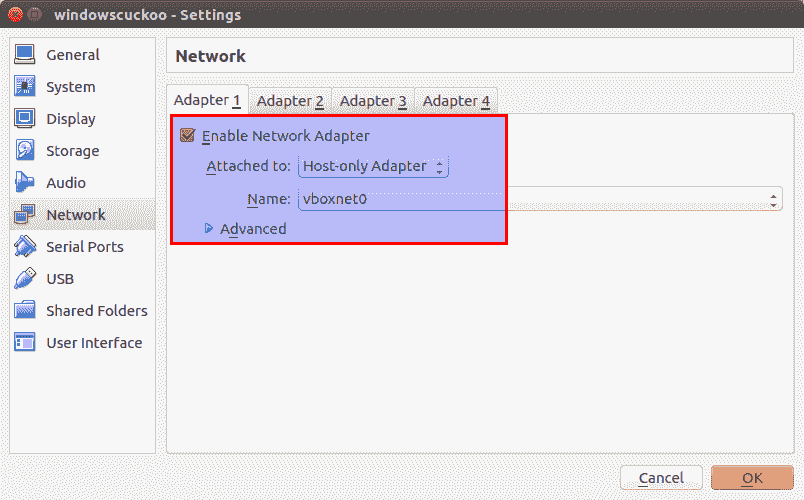

第二个适配器是 NAT:


一旦 Windows 虚拟机启动，我们需要安装 VirtualBox 来宾添加工具。这允许布谷鸟使用名为 VBoxManage 的命令行实用程序执行分析:


接下来要在本地安装 Python 才能在本地启动布谷鸟代理，我们可以从 Python 官方网站:[https://www.python.org/downloads/release/python-2714](https://www.python.org/downloads/release/python-2714)安装 Python。

现在从布谷鸟主机下载代理，它将出现在`agent`文件夹的布谷鸟工作目录中。我们需要将它保存在 Windows 虚拟机中，以便布谷鸟服务器与之交互:

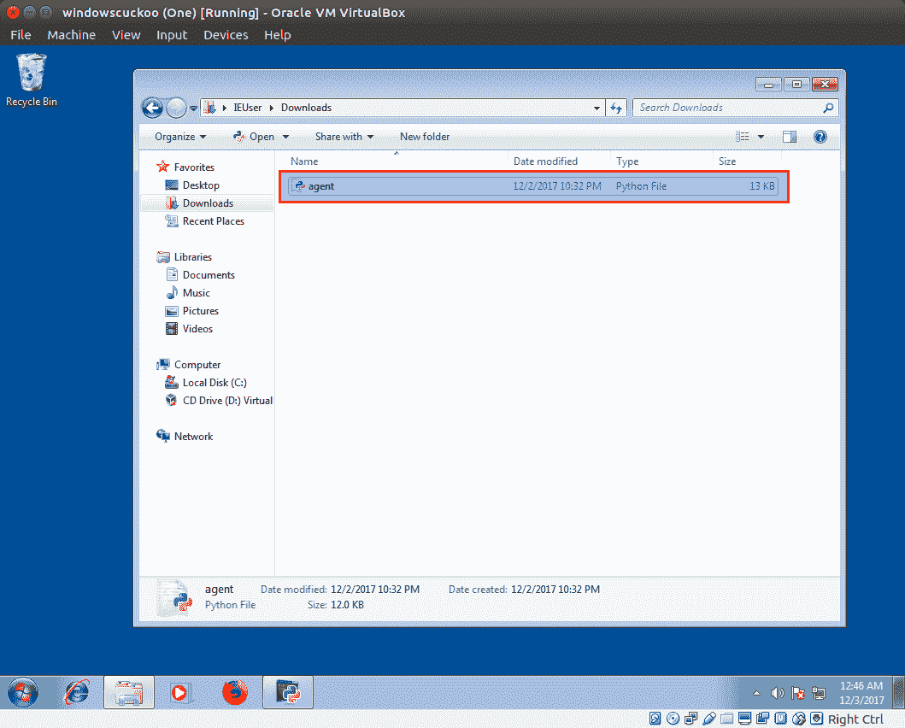

然后，我们必须使用`regedit`命令将 Python 文件路径添加到系统启动中。这可以通过导航到`HKEY_LOCAL_MACHINE\SOFTWARE\Microsoft\Windows\Current\Version\Run`来完成。然后，在注册表编辑器右侧添加新字符串，名称为杜鹃，并在值部分给出`agent.py`文件的完整路径:


现在，我们可以拍摄快照并更新布谷鸟主机中的配置。完成后，我们就可以启动布谷鸟服务器和网络服务器了。

下面的截图是布谷鸟网络服务器的主页。提交恶意软件样本后，我们可以点击分析开始:

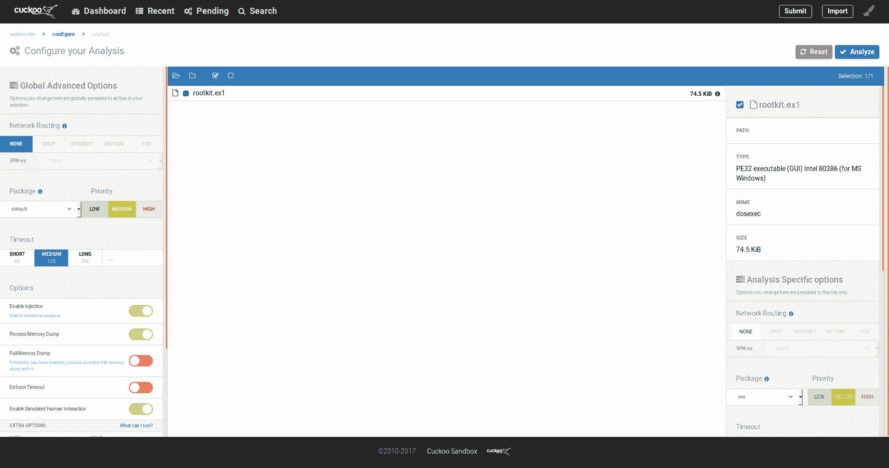

然后，用 VirtualBox Windows 虚拟机执行分析需要一些时间。这将根据您选择的选项执行分析:


然后，它将给出关于样本的完整详细信息。它包括提交的文件校验和、布谷鸟执行分析时的运行时执行截图等信息:


以下截图是恶意软件示例的行为分析，其中包括对流程树的详细分析。左侧菜单包含不同的选项，如删除文件、内存转储分析和数据包分析:

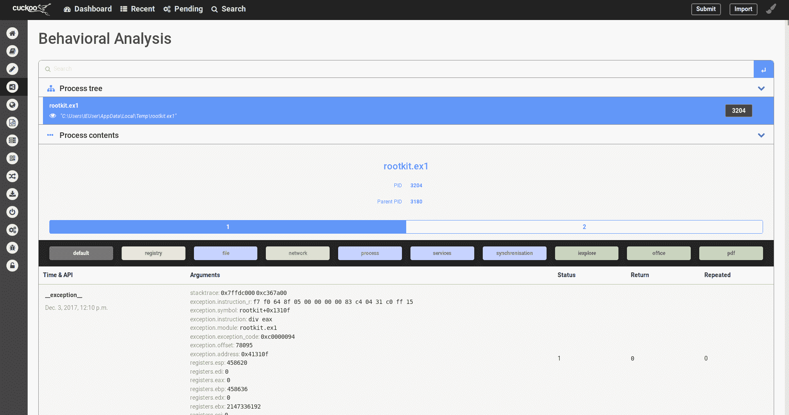

Learn more about Cuckoo usage in the Cuckoo documentation at [http://docs.cuckoosandbox.org/en/latest/usage](http://docs.cuckoosandbox.org/en/latest/usage).

# 使用 Ansible 行动手册提交样品和报告

以下行动手册将对本地系统路径中的给定恶意软件样本文件进行分析，并使用 Ansible 行动手册将报告返回给:

```
- name: Cuckoo malware sample analysis
  hosts: cuckoo
  vars:
    local_binaries_path: /tmp/binaries

  tasks:
    - name: copying malware sample to cuckoo for analysis
      copy:
        src: "{{ local_binaries_path }}"
        dest: "/tmp/binaries/{{ Ansible_hostname }}"

    - name: submitting the files to cuckoo for analysis
      command: "cuckoo submit /tmp/binaries/{{ Ansible_hostname }}"
      ignore_errors: yes
```

以下截图将恶意软件样本复制到布谷鸟分析系统，并使用 Ansible playbook 提交这些文件进行自动分析:

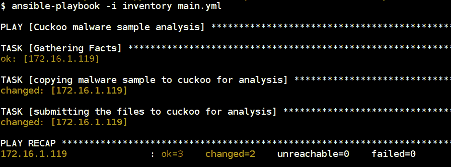

前面的截图将本地二进制文件复制到远程布谷鸟主机中，并使用布谷鸟提交功能提交它们进行分析:


前面的截图是我们的布谷鸟扫描提交使用 Ansible Playbook 提交的分析报告。

# 使用 Docker 容器设置布谷鸟

这将允许我们使用 Docker 容器简化布谷鸟的设置。以下命令将允许我们使用 Docker 容器设置布谷鸟沙盒:

```
$ git clone https://github.com/blacktop/docker-cuckoo
$ cd docker-cuckoo
$ docker-compose up -d
```

下载 Docker 容器并将其配置为协同工作需要一段时间。安装完成后，我们可以使用`http://localhost`访问布谷鸟:

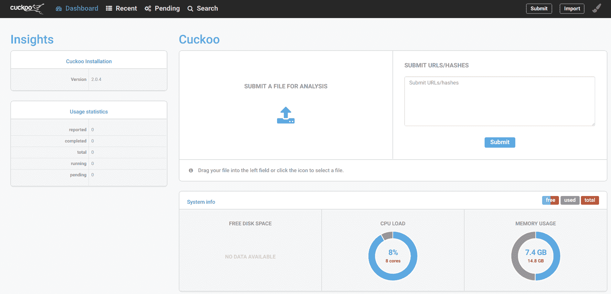

现在，我们可以将恶意软件样本或可疑文件提交给布谷鸟，使用该工具集进行分析，它将返回详细的分析。在提交样本之前，我们还可以通过选择配置选项来选择要执行的分析。

# 设置 MISP 和威胁共享

**恶意软件信息共享平台(MISP)** 是一个开源的威胁共享平台([http://www.misp-project.org](http://www.misp-project.org))。它允许我们在已知社区和组织内交换关于**高级持续威胁** ( **APT** )和目标攻击的**妥协指标** ( **IOCs** )。通过这样做，我们可以获得更多关于不同攻击和威胁的知识，并且组织可以轻松防御此类攻击。

开始使用该平台的最简单方法是使用由**计算机事件响应中心卢森堡** ( **CIRCL** )定制的虚拟机，其中包括最新版本的完整设置。该虚拟机经过定制，可在不同的环境中工作。

The VM and training materials can be found at [https://www.circl.lu/services/misp-training-materials](https://www.circl.lu/services/misp-training-materials).

# 使用 Ansible 行动手册建立 MISP

我们还可以使用 Ansible 行动手册进行设置。根据我们的定制使用，社区中有多种行动手册:

*   [https://github . com/jujuju 4/ansable-misp](https://github.com/juju4/Ansible-MISP)
*   [https://github.com/StamusNetworks/Ansible-misp](https://github.com/StamusNetworks/Ansible-misp)

使用现有的 Ansible 行动手册设置 MISP 就像克隆存储库和更新所需更改和配置的变量一样简单。确保在执行行动手册之前更新变量:

```
$ git clone https://github.com/StamusNetworks/Ansible-misp.git
$ cd Ansible-misp
$ Ansible-playbook -i hosts misp.yaml
```

# MISP 网络用户界面

以下是 MISP 虚拟机网络界面。以下是 MISP 虚拟机的默认凭据:

```
For the MISP web interface -> admin@admin.test:admin
For the system -> misp:Password1234
```

以下截图为带登录面板的**恶意软件信息共享平台** ( **MISP** )首页:

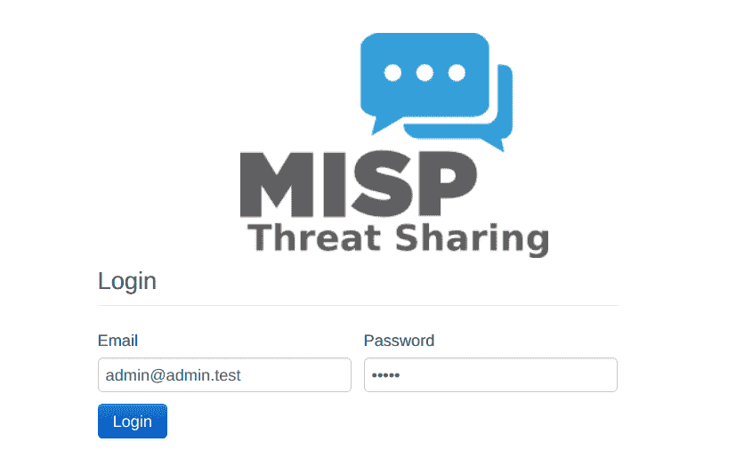

下面的截图是 MISP 平台 web 界面的主屏幕，它包含共享 IOC、添加组织和执行访问控制等功能的选项:


Read more about MISP using their documentation to learn different features available in MISP at [https://www.circl.lu/doc/misp/](https://www.circl.lu/doc/misp/).

# 建立蝰蛇-二进制管理和分析框架

**Viper**([http://Viper . Li](http://viper.li))是一个专门针对恶意软件和漏洞利用研究人员的框架。它提供了一个简单的解决方案，可以轻松组织恶意软件集合和利用样本。它为研究人员对二进制文件和恶意软件样本进行分析提供了命令行界面和网络界面。

下面的剧本将设置整个 Viper 框架。它有两个角色，一个是设置运行 Viper 框架所需的依赖项，另一个是主设置:

```
- name: Setting up Viper - binary management and analysis framework
  hosts: viper
  remote_user: ubuntu
  become: yes

  roles:
    - dependencies
    - setup
```

下面的代码片段用于设置依赖项和其他必需的包:

```
- name: installing required packages
  apt:
    name: "{{ item }}"
    state: present
    update_cache: yes

  with_items:
    - gcc
    - python-dev
    - python-pip
    - libssl-dev
    - swig

- name: downloading ssdeep release
  unarchive:
    src: https://github.com/ssdeep-project/ssdeep/releases/download/release-2.14.1/ssdeep-2.14.1.tar.gz
    dest: /tmp/
    remote_src: yes

- name: copy ssdeep setup script
  template:
    src: ssdeep.sh
    dest: /tmp/ssdeep.sh
    mode: 0755

- name: installing ssdeep
  shell: /tmp/ssdeep.sh
  ignore_errors: yes

- name: installing core dependencies
  pip:
    name: "{{ item }}"
    state: present

  with_items:
    - SQLAlchemy
    - PrettyTable
    - python-magic
    - pydeep
```

这里，我们使用一个自定义的 shell 脚本来设置`ssdeep`，它必须执行编译和构建:

```
#!/bin/bash

cd /tmp/ssdeep-2.14.1
./configure
./bootstrap
make
make install
```

设置角色将安装 Viper 包和所需的依赖项，并启动 web 服务器来访问 Viper web 用户界面:

```
- name: downloading the release
  unarchive:
    src: https://github.com/viper-framework/viper/archive/v1.2.tar.gz
    dest: /opt/
    remote_src: yes

- name: installing pip dependencies
  pip:
    requirements: /opt/viper-1.2/requirements.txt

- name: starting viper webinterface
  shell: nohup /usr/bin/python /opt/viper-1.2/web.py -H 0.0.0.0 &
  ignore_errors: yes

- debug:
    msg: "Viper web interface is running at http://{{ inventory_hostname }}:9090"
```

下面的截图指的是 Viper 框架设置的剧本执行。它返回要访问的网页界面网址:


如果导航到`http://192.18.33.22:9090`，可以看到使用这个框架的 web 界面有很多选项:


下面的截图是我们分析的恶意软件样本的输出。该 Viper 框架还支持 YARA 规则集、病毒总应用编程接口和其他模块，可根据用例执行深入分析:

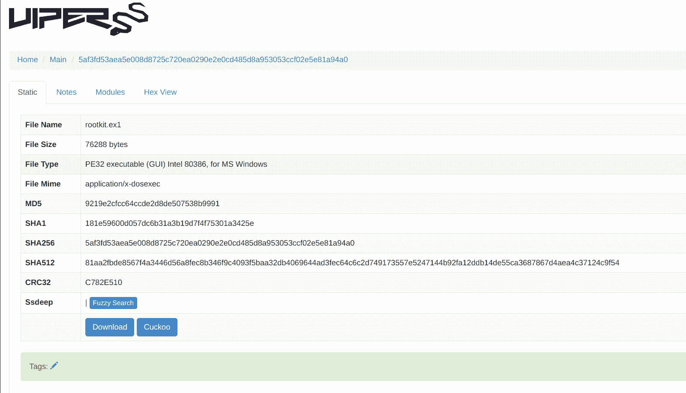

# 利用取证工件的安全备份，创建用于收集和存储的Ansible行动手册

Ansible 是各种 bash 脚本的合适替代品。通常，对于大多数需要分析的活动，我们遵循一个固定的模式:

1.  使用我们已经知道的路径将运行进程的日志收集到文件中
2.  定期将这些日志文件中的内容复制到本地的安全存储中，或者通过 SSH 或网络文件共享远程访问
3.  复制成功后，旋转日志

由于涉及到一些网络活动，我们的 bash 脚本通常被编写为对网络连接具有容错能力，并且很快变得复杂。可操作的行动手册可以用来完成所有这些任务，同时便于每个人阅读。

# 收集事件响应的日志工件

事件响应的关键阶段是**日志分析**。以下行动手册将从所有主机收集日志并存储在本地。这允许响应者执行进一步的分析:

```
# Reference https://www.Ansible.com/security-automation-with-Ansible

- name: Gather log files
  hosts: servers
  become: yes

  tasks:
    - name: List files to grab
      find:
        paths:
          - /var/log
        patterns:
          - '*.log*'
        recurse: yes
      register: log_files

    - name: Grab files
      fetch:
        src: "{{ item.path }}"
        dest: "/tmp/LOGS_{{ Ansible_fqdn }}/"
      with_items: "{{ log_files.files }}"
```

以下剧本执行将使用 Ansible 模块收集远程主机中指定位置的日志列表，并将它们存储在本地系统中。行动手册的日志输出如下所示:

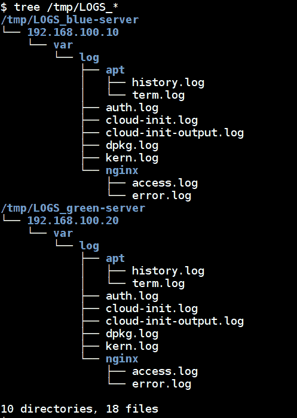

# 数据收集的安全备份

从服务器收集多组数据时，使用加密备份安全存储它们非常重要。这可以通过将数据备份到存储服务(如 S3)来实现。

以下 Ansible 行动手册允许我们将收集的数据安装并复制到启用加密的 AWS S3 服务中:

```
- name: backing up the log data
  hosts: localhost
  gather_facts: false
  become: yes
  vars:
    s3_access_key: XXXXXXX # Use Ansible-vault to encrypt
    s3_access_secret: XXXXXXX # Use Ansible-vault to encrypt
    localfolder: /tmp/LOGS/ # Trailing slash is important
    remotebucket: secretforensicsdatausingAnsible # This should be unique in s3

  tasks:
    - name: installing s3cmd if not installed
      apt:
        name: "{{ item }}"
        state: present
        update_cache: yes

      with_items:
        - python-magic
        - python-dateutil
        - s3cmd

    - name: create s3cmd config file
      template:
        src: s3cmd.j2
        dest: /root/.s3cfg
        owner: root
        group: root
        mode: 0640

    - name: make sure "{{ remotebucket }}" is avilable
      command: "s3cmd mb s3://{{ remotebucket }}/ -c /root/.s3cfg"

    - name: running the s3 backup to "{{ remotebucket }}"
      command: "s3cmd sync {{ localfolder }} --preserve s3://{{ remotebucket }}/ -c /root/.s3cfg"
```

对于`s3cmd`配置，配置文件如下所示:

```
[default]
access_key = {{ s3_access_key }}
secret_key = {{ s3_access_secret }}
host_base = s3.amazonaws.com
host_bucket = %(bucket)s.s3.amazonaws.com
website_endpoint = http://%(bucket)s.s3-website-%(location)s.amazonaws.com/
use_https = True
signature_v2 = True
```

以下截图是将数据上传到 S3 存储桶的 Ansible 行动手册执行情况:


前面的截图显示了 Ansible 行动手册安装`s3cmd`，创建名为`secretforensicsdatausingAnsible`的新存储桶，并将本地日志数据复制到远程 S3 存储桶。

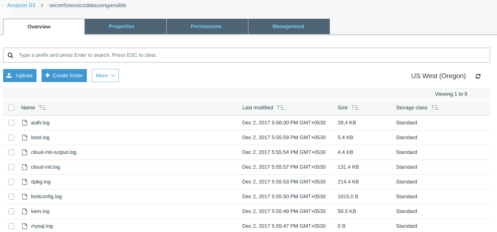

前面的截图是剧本的结果。我们可以看到日志成功上传到 S3 AWS 的`secretforensicsdatausingAnsible` S3 桶中。

# 摘要

能够自动化恶意软件分析所需的各种工作流，使我们能够扩展正在分析的恶意软件数量以及进行此类大规模分析所需的资源。这是解决每天在互联网上发布的恶意软件泛滥的一种方法，并创建有用的防御措施。

在下一章中，我们将继续创建一个用于安全测试的 Ansible 模块。我们将采取一些小步骤来创建这个模块，从理解基础知识到利用和使用 OWASP ZAP 的应用编程接口来扫描网站。到本章结束时，您将拥有一个完整的模块，可以与 Ansible CLI 或 Ansible 行动手册一起使用。