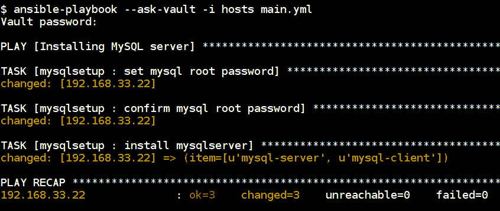
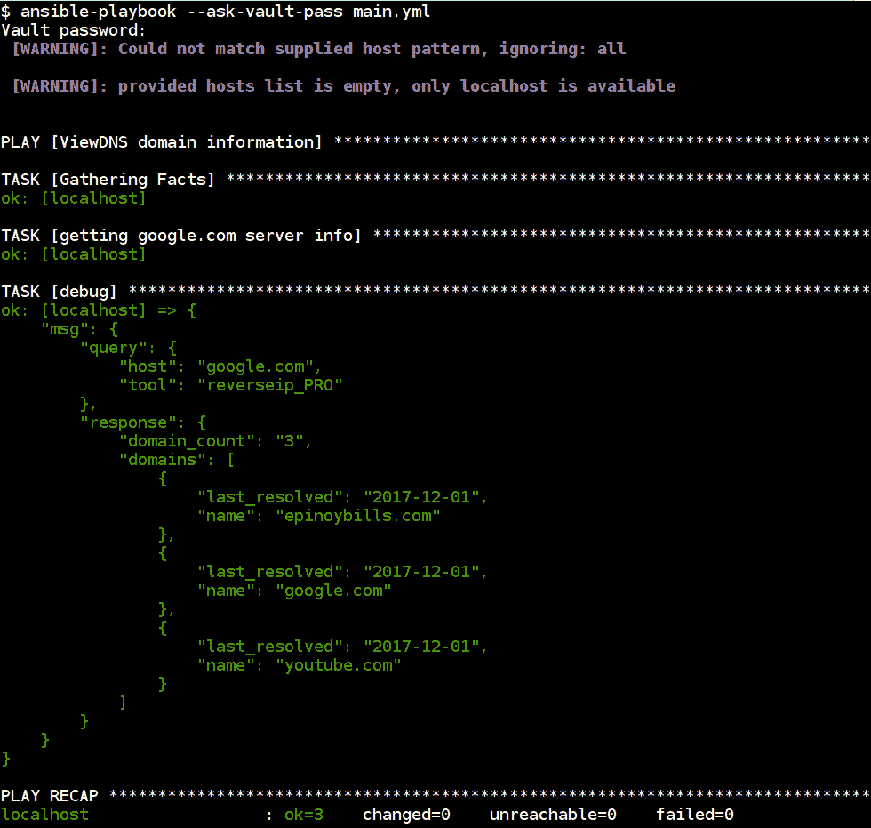
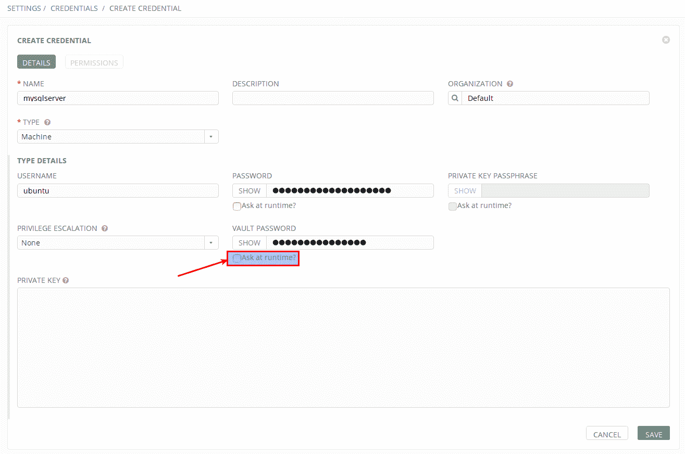
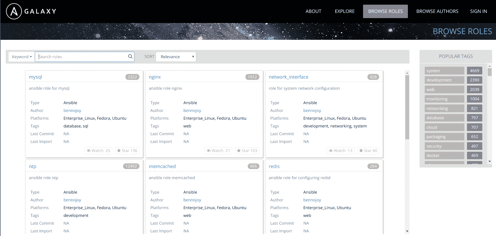
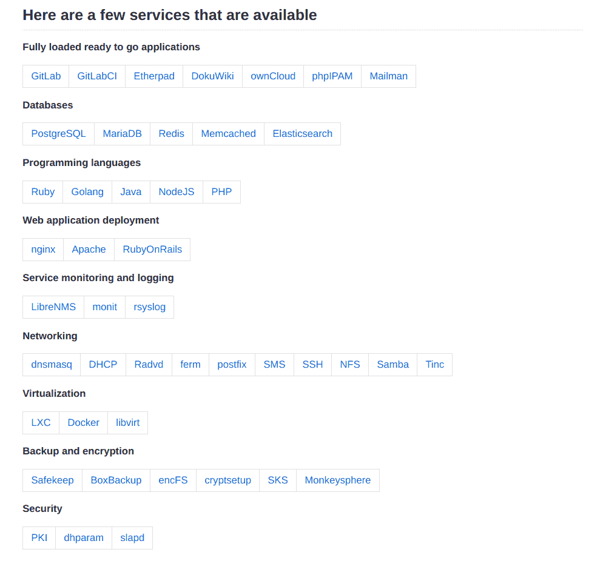

# 可靠的安全最佳实践、参考和进一步阅读

最后一章。我们终于到了。是时候反思我们一起学到的东西了。是时候列出你应该从这里走向何方了。最重要的是，有几个主题将增强您使用 Ansible 的体验。

我们将在本章中讨论的一些主题如下:

*   使用 Ansible 保管库以及为什么您应该将所有秘密存储在保管库中
*   使用 Ansible Galaxy 共享行动手册和角色
*   固定主控制器
*   附加参考
*   期待 Ansible 2.5 的新功能和即将推出的功能

# 使用Ansible的保管库

Ansible Vault 是一个命令行实用程序，默认情况下与 Ansible 一起安装。它允许我们对密钥、凭据、密码等机密进行加密，以包含在我们的行动手册中。通过这样做，我们还可以使用这些加密文件与其他人共享，因为它们包含密码保护来访问加密数据。我们可以使用这个特性来加密我们的行动手册中的变量、模板和文件。

Ansible 2.3 版本支持使用带有`!vault`标签的 ansi ble 单一加密变量加密单一变量。我们将在下一部分的行动手册中看到一些如何使用这种方法的示例。

Read more about Ansible Vault at [https://docs.ansible.com/ansible/latest/vault.html](https://docs.ansible.com/ansible/latest/vault.html).

由于这是一种非常简单而强大的存储和管理机密数据的方法，因此使用 Ansible Vault 来存储我们行动手册中的所有机密信息非常重要。

一些真正好的用例包括我们如何在不改变版本控制系统、CI/CD 集成管道等的情况下使用这些行动手册。

# 如何对变量和文件使用 Ansible Vault

以下示例演示了如何在我们的行动手册变量文件中使用机密。

让我们用下面的剧本举一个在 Ubuntu 操作系统中安装 MySQL 服务器的例子。根据 Ansible 文档，以不同的方式存储 Vault 变量和普通变量更容易也更好。

下面的代码片段是用根密码安装 MySQL 服务器的高级文件结构:

```
├── group_vars
│   └── mysql.yml # contains vault secret values
├── hosts
├── main.yml
└── roles
    └── mysqlsetup
        └── tasks
            └── main.yml

```

现在我们可以看到`mysqlsetup`角色包含以下需要`mysql_root_password`变量的任务，该变量包含 MySQL 服务器的根密码:

```
- name: set mysql root password
  debconf:
    name: mysql-server
    question: mysql-server/root_password
    value: "{{ mysql_root_password | quote }}"
    vtype: password

- name: confirm mysql root password
  debconf: 
    name: mysql-server
    question: mysql-server/root_password_again
    value: "{{ mysql_root_password | quote }}"
    vtype: password

- name: install mysqlserver
  apt:
    name: "{{ item }}"
    state: present
    update_cache: yes

  with_items:
   - mysql-server
   - mysql-client
```

现在，如果我们看到`group_vars/main.yml`文件，内容看起来如代码块所示。它包含在剧本中使用的秘密变量，称为`mysql_root_password`:

```
mysql_root_password: supersecretpassword​
```

要加密 vault 文件，我们将使用以下命令，然后它会提示输入要保护的密码:

```
$ ansible-vault encrypt group_vars/mysql.yml

New Vault password: 
Confirm New Vault password: 
Encryption successful
```

现在，如果我们看到 vault 内容，它看起来如下所示，使用给定的密码进行`AES256`加密:

```
$ cat group_vars/main.yml 

$ANSIBLE_VAULT;1.1;AES256
30356164636532373531656636666330316330373764323938653462376630653038386531303362
3631623330663939666235326638343164393564303630320a383338613635623533383236613339
65333164663262626565333231343861613764383238363136333639643637353439623832356263
3038343830373137650a633261653037306438633030326165356436623832386230373030326131
34353534313337616561643333613435396636363836396239306139383330333539653138343231
6430656638626162306463333736666536336139643637376636
```

现在，要执行播放手册，请运行以下命令，它将提示输入保管库密码:

```
$ ansible-playbook --ask-vault-pass -i hosts main.yml
```

下面的截图显示了我们在执行 Ansible 行动手册时提供的保管库密码



*   我们还可以通过指定标志来传递带有剧本执行的`ansible-vault`密码文件，这有助于我们的持续集成和流水线平台。
*   以下文件包含用于加密`mysql.yml`文件的密码:

```
$ cat ~/.vaultpassword

thisisvaultpassword
```

Make sure to give proper permissions for this file, so others cannot access this file using `chmod`. Also, it's good practice to add this file to your `.gitignore`, so it will not be version controlled when pushing playbooks.

Vault password file can be an executable script, which can retrieve data stored somewhere securely rather than having to keep the key in plain text on disk and relying on file permissions to keep it safe.

要通过命令行传递保管库密码文件，请在执行行动手册时使用以下命令:

```
$ ansible-playbook --vault-password-file ~/.vaultpassword -i hosts main.yml
```

We can also use system environment variables such as `ANSIBLE_VAULT_PASSWORD_FILE=~/.vaultpassword` and Ansible will use this while executing playbooks.

我们可以使用`ansible-vault`进行多次操作，比如使用`create`参数创建文件。默认情况下，这会加密文件内容。它还会打开默认的文本编辑器来编辑文件:

```
$ ansbile-vault create vault.yml

New Vault password: 
Confirm New Vault password: 
```

我们可以使用`view`命令以纯文本方式查看金库加密信息。

```
$ ansible-vault view vault.yml
Vault password: 
API_KEY: KANGEG4TNG434G43HG43H9GH344FEGEW
```

要更改内容，我们可以使用`ansible-vault`中的`edit`子命令:

```
$ ansible-vault edit vault.yml

Vault password: 
```

我们还可以使用以下命令解密机密信息

```
$ ansible-vault decrypt vault.yml

Vault password: 
Decryption successful
```

要更改密钥轮换的保管库密码，我们可以使用`rekey`选项:

```
$ ansible-vault rekey vault.yml
Vault password: 
New Vault password: 
Confirm New Vault password: 
Rekey successful
```

# Ansible Vault 单一加密变量

该功能可从 Ansible 版获得。它允许我们在 YAML 文件中使用带有`!vault`标签的存储变量；我们将看到一个简单的例子和用例。

以下剧本用于使用`ViewDNS` API 执行反向 IP 查找。

我们希望保护`api_key`的安全，因为它包含敏感信息。我们使用`ansible-vault encrypt_string`命令来执行加密。这里，我们使用带有`-n`标志的`echo`删除新行:

```
$ echo -n '53ff4ad63849e6977cb652763g7b7c64e2fa42a' | ansible-vault encrypt_string --stdin-name 'api_key'
```


然后，我们可以将变量放入剧本变量中，如下面的代码块所示，并使用带有`--ask-vault-pass`选项的`ansible-playbook`正常执行剧本:

```
- name: ViewDNS domain information
  hosts: localhost
  vars:
    domain: google.com
    api_key: !vault |
          $ANSIBLE_VAULT;1.1;AES256
          36623761316238613461326466326162373764353437393733343334376161336630333532626465
          6662383435303930303164353664643639303761353664330a393365633237306530653963353764
          64626237313738656530373639653739656564316161663831653431623832336635393637653330
          6632663563363264340a323537356166653338396135376161323435393730306133626635376539
          37383861653239326336613837666237636463396465393662666561393132343166666334653465
          6265386136386132363534336532623061646438363235383334
    output_type: json

  tasks:
    - name: "getting {{ domain }} server info"
      uri:
        url: "https://api.viewdns.info/reverseip/?host={{ domain }}&apikey={{ api_key }}&output={{ output_type }}"
        method: GET
      register: results

    - debug:
        msg: "{{ results.json }}"
```

然后，正在执行的剧本将在我们提供给它给定的密码后自动解密。

下面的屏幕截图显示了提示输入保管库密码后执行的行动手册。



Read more about `encrypt_string` options at [https://docs.ansible.com/ansible/2.4/vault.html#use-encrypt-string-to-create-encrypted-variables-to-embed-in-yaml](https://docs.ansible.com/ansible/2.4/vault.html#use-encrypt-string-to-create-encrypted-variables-to-embed-in-yaml).

# Ansible拱顶在Ansible塔中的应用

Ansible Tower 已经与 Ansible Vault 集成在一起。

下面的截图提到了在 Ansible Tower 中创建新凭据。此外，我们还可以添加保管库密码，这使用户能够使用更安全的方式存储和检索秘密



# 设置和使用可扫描集群

Ansible Galaxy，也称为 Galaxy，是一个官方的集中式中心，用于查找、共享和重用 Ansible 角色。这允许社区共享和协作 Ansible 行动手册，并允许新用户快速开始使用 Ansible。为了与社区共享我们定制的角色，我们可以使用 GitHub 身份验证将它们发布到 Ansible Galaxy。

这些角色可以在[https://galaxy.ansible.com](https://galaxy.ansible.com)访问，也可以使用名为`ansible-galaxy`的命令行工具访问，该工具与 Ansible 一起安装:



我们可以使用不同的参数找到角色，如作者、平台、标签等。这使用户能够了解该角色是否适用于他们的发行版和版本、需要哪个 Ansible 版本以及其他信息。

下面的截图展示了我们如何使用`ansible-galaxy` CLI 执行不同的操作，比如搜索和安装:


Read more about Ansible Galaxy from docs at [http://docs.ansible.com/ansible/latest/galaxy.html](http://docs.ansible.com/ansible/latest/galaxy.html).

Learn more about Galaxy usage at [https://galaxy.ansible.com/intro](https://galaxy.ansible.com/intro).

# 使用Ansible的银河角色

要从 Ansible Galaxy 网站下载角色，我们可以运行以下命令，其中`username`和`role_name`是选项:

```
$ ansible-galaxy install username.role_name
```

以下命令将由用户`angstwad`下载`docker_ubuntu`角色:

```
$ ansible-galaxy install angstwad.docker_ubuntu

- downloading role 'docker_ubuntu', owned by angstwad
- downloading role from https://github.com/angstwad/docker.ubuntu/archive/v3.3.4.tar.gz
- extracting angstwad.docker_ubuntu to /home/ubuntu/.ansible/roles/angstwad.docker_ubuntu
- angstwad.docker_ubuntu (v3.3.4) was installed successfully
```

使用这个角色在 Ubuntu 上安装 Docker 就像在我们的剧本中包含这个角色并执行它一样简单:

```
- name: Run docker.ubuntu
 hosts: docker
 become: yes

 roles:
 - angstwad.docker_ubuntu $ ansible-playbook -i hosts main.yml
```

我们可以通过指定 GitHub URL 直接从 GitHub 安装或包含角色。这允许使用私有版本控制系统作为行动手册角色的本地清单:

```
$ ansible-galaxy install git+https://github.com/geerlingguy/ansible-role-composer.git
```

# 向 Ansible Galaxy 发布我们的角色

要将我们自己的角色发布到 Ansible Galaxy，我们需要有一个 GitHub 账户，这个账户将用于认证 Ansible Galaxy，GitHub 中的版本控制存储库将是存储我们角色的地方。

以下步骤用于在 Ansible Galaxy 中创建和共享新角色:

1.  首先，在 GitHub 中创建新的存储库，并使用以下命令在本地克隆它:

```
$ git clone https://username@github.com/username/ansible-role-docker.git docker
```

2.  然后我们可以使用`ansible-galaxy`命令创建一个角色结构来创建该结构:

```
$ ansible-galaxy init docker --force
- docker was created successfully

# The structure looks like below
├── defaults
│   └── main.yml
├── files
├── handlers
│   └── main.yml
├── meta
│   └── main.yml
├── README.md
├── tasks
│   └── main.yml
├── templates
├── tests
│   ├── inventory
│   └── test.yml
└── vars
 └── main.yml
```

3.  现在，我们可以像以前一样添加任务和其他步骤。以下是 Ansible Galaxy 本身([https://galaxy.ansible.com/intro#good](https://galaxy.ansible.com/intro#good))的一些好做法:
    1.  在`README.md`中提供清晰的文件。
    2.  在`meta/main.yml`中给出准确的信息。
    3.  在`meta/main.yml`中包含依赖关系。
    4.  用角色名作为变量名的前缀。
    5.  将您的角色与特拉维斯 CI 整合。
4.  元文件包含将用于在 Ansible Galaxy 中发布角色的信息；我们可以根据需要修改它。这里有一个例子:

```
---
galaxy_info:
  author: USERNAME
  description: Quick and easy docker installer.
  company: ORG
  license: MIT
  min_ansible_version: 1.9
  platforms:
  - name: Ubuntu
    versions:
    - xenial
    - trusty
  galaxy_tags:
    - docker
    - installer
    - ubuntu
dependencies:
  - { role: username.common, some_parameter: 3 }
```

5.  然后我们可以将角色推送到 GitHub，并通过在门户中添加一个新角色将其导入 Ansible Galaxy:


Refer to http://docs.ansible.com/ansible/latest/playbooks_reuse.html for how to write reusable roles and more details about writing community roles.

# Ansible的银河本地设置

要在本地建立 Ansible Galaxy，我们有不同的方法。大多数装置在幕后使用容器。以下步骤描述了如何使用`docker`和`docker-compose`安装 Ansible Galaxy 本地设置。

在继续之前，我们需要以下先决条件:

*   Ansible 2.4+
*   码头工人
*   `docker-py` Python 模块
*   `docker-compose` Python 模块
*   GNU 品牌
*   饭桶

我们可以通过运行以下`git`命令来克隆`galaxy`存储库，该命令将克隆由 Ansible 维护的整个银河存储库:

```
$ git clone https://github.com/ansible/galaxy.git
$ cd galaxy/installer
```

更改 galaxy 行动手册中所需的变量；默认情况下，它将假设安装在 localhost 中。另外，更新`inventory`文件中的密码和其他变量:

然后执行以下命令启动 Ansible 行动手册设置，以启动本地 Ansible Galaxy

```
$ ansible-playbook -i inventory galaxy.yml --tags start
```

这将需要一段时间，因为它必须在本地下载多个 Docker 容器，并使用`docker-compose`设置它们之间的集成。

一旦剧本执行完成，我们可以看到以下关于运行 Docker 容器的输出。执行数据库迁移和启动 web 服务器应用程序仍然需要一些时间:


设置完成后，我们可以导航到`http://localhost`查看网页界面:


Read more about Ansible Galaxy local setup and other options for authentication and deployment at [https://github.com/ansible/galaxy/blob/develop/INSTALL.md](https://github.com/ansible/galaxy/blob/develop/INSTALL.md).

# 安全控制器机器安全

Ansible 的控制器机器需要安装和配置 SSH 和 Python。Ansible 的攻击面非常低。2017 年 1 月，一家名为 Computest 的公司发现了多个安全问题。

Read more about what they found at [https://www.computest.nl/advisories/CT-2017-0109_Ansible.txt](https://www.computest.nl/advisories/CT-2017-0109_Ansible.txt).

This vulnerability was dubbed *owning the farm*, since compromising the controller would imply that all the nodes could potentially be compromised.

控制器机器应该是一个坚固的服务器，并受到应有的严肃对待。在公开的漏洞中，如果节点受到攻击，攻击者可以利用该漏洞进行攻击并获得对控制器的访问权限。一旦获得访问权限，就可以将其控制范围扩展到由控制器管理的所有其他节点。

由于攻击面已经非常有限，我们能做的最好的事情就是确保服务器保持安全和坚固。

值得关注和研究的两个项目是:

*   https://docs.openstack.org/ansible-hardening/latest/getting-started.html#usage
*   https://github.com/dev-sec/ansible-os-hardening

# 解释Ansible操作系统强化行动手册

在[第 7 章](07.html)、*应用和网络安全强化*中，我们看到了多份遵循不同标准的行动手册和指南。这可以根据您的环境完全定制，但遵循某些准则将确保它得到很好的保护。

下面的剧本是由 DevSec 为 Linux 基线创建的。它涵盖了基于多种标准的大多数必要的强化检查，包括 Ubuntu 安全功能、NSA 安全配置指南、ArchLinux 系统强化和其他。如果需要，可以通过添加更多任务(或角色)来改进这一点。

可扩展操作系统强化行动手册涵盖

*   配置包管理，即只允许已签名的包
*   删除存在已知问题的包
*   配置`pam`和`pam_limits`模块
*   影子密码套件配置
*   配置系统路径权限
*   通过软限制禁用核心转储
*   限制系统控制台的超级用户登录
*   设置 SUIDs
*   通过`sysctl`配置内核参数

以下命令是从 Ansible Galaxy 下载`os-hardening`角色:

```
$ ansible-galaxy install dev-sec.os-hardening
```


然后在您的行动手册中调用该角色并执行它来执行基准强化，并根据需要更改变量。更多详细选项请参考[https://galaxy.ansible.com/dev-sec/os-hardening](https://galaxy.ansible.com/dev-sec/os-hardening):

```
- hosts: localhost
 become: yes

 roles:
 - dev-sec.os-hardening
$ ansible-playbook main.yml
```

下面的屏幕截图指的是行动手册的执行，以及它在 Ansible 控制器机器上执行的检查列表:


以下是通过更新系统中的配置参数来最小化系统访问的检查:


下面的截图是关于升级密码散列算法，更新超级用户二进制文件的`suid`和指南:


To know more checks what this playbook executes visit [https://github.com/dev-sec/ansible-os-hardening/blob/master/tasks/main.yml](https://github.com/dev-sec/ansible-os-hardening/blob/master/tasks/main.yml).

# 最佳实践和参考行动手册项目

Ansible 功能强大且灵活。人们以许多不同的方式使用它，我们能够理解如何将它用于安全自动化的方法之一是跟踪和阅读为特定用例创建的行动手册。

Algo、DebOps 和 OpenStack 等项目都是大型 Ansible 剧本项目，默认情况下维护良好且安全。

# DebOps–盒子里的基于 Debian 的数据中心

DebOps([https://debops.org](https://debops.org))是一个由 Maciej Delmanowski 创建的项目。它包含了可用于 Debian 和 Ubuntu 主机的各种 Ansible 行动手册的集合。这个项目有超过 128 个 Ansible 角色，这些角色是为生产用例定制的，并且可以在多个环境中工作。

我们可以在[https://github.com/debops/debops-playbooks](https://github.com/debops/debops-playbooks)看到可用的行动手册服务列表:



# 设置 DebOps 控制器

有两种不同的方法可以让我们快速开始使用 DebOps 设置:

*   流浪设置
*   码头工人设置

运行以下命令启动由 DebOps 创建的 Docker 容器:

```
$ docker run --name debops -it debops/debops
```

We can create and execute different roles to perform different actions using DebOps playbooks. Refer to the main documentation at [https://docs.debops.org/en/latest/index.html](https://docs.debops.org/en/latest/index.html).

# algo–在云中设置个人 IPSEC 虚拟专用网络

Bits Trail 的 Algo 提供了Ansible的角色和脚本来自动安装个人 IPSEC 虚拟专用网络。

By running the Ansible playbooks, you get a complete hardened VPN server, and deployments to all major cloud providers are already configured ([https://github.com/trailofbits/algo/blob/master/docs/deploy-from-ansible.md](https://github.com/trailofbits/algo/blob/master/docs/deploy-from-ansible.md)).

# OpenStack-Ansible

OpenStack-Ansible 是使用 Ansible 行动手册部署和配置 OpenStack 的官方项目。

Start here for OpenStack-Ansible: [https://github.com/openstack/openstack-ansible](https://github.com/openstack/openstack-ansible).

该项目不仅广泛使用 Ansible 行动手册，而且其安全文档也值得阅读和效仿。最好的部分是所有的安全配置都是编写在 Ansible 行动手册中的声明性安全。

Documentation on this project is available at [https://docs.openstack.org/project-deploy-guide/openstack-ansible/latest/app-security.html](https://docs.openstack.org/project-deploy-guide/openstack-ansible/latest/app-security.html).

# 附加参考

在本书的研究过程中，我们发现了一些不错的 Ansible 在线参考资料和链接，包括:

*   **史翠珊**:自动安装配置反审查软件
*   **独占**:使用 Ansible 行动手册维护自己的私有云
*   **AWX** :开源版本的 Ansible Tower

# 史翠珊-自动安装和配置反审查软件

使用 Ansible 行动手册，史翠珊可以设置一个装满软件的云服务器，绕过互联网限制和在线审查。设置的工具包括基于 IPSEC 的虚拟专用网络、开放虚拟专用网络、开放连接、Tor 和 WireGuard。

Get started with Streisand at [https://github.com/StreisandEffect/streisand](https://github.com/StreisandEffect/streisand).

# 主权–使用 Ansible 行动手册维护您自己的私有云

使用 Ansible 行动手册，王爷用开源软件建立了自己的私有云。这使您可以通过包括电子邮件、日历、文件同步、RSS 阅读器、Git 托管、稍后阅读和聊天在内的服务来控制您的数据。

Get started with Sovereign at [https://github.com/sovereign/sovereign](https://github.com/sovereign/sovereign).

# AWX——开源版本的 Ansible Tower

AWX 提供了一个基于网络的用户界面、REST API 和建立在 Ansible 之上的任务引擎。AWX 可以与塔式命令行界面工具和客户端库一起使用。

Get started with AWX here: [https://github.com/ansible/awx](https://github.com/ansible/awx).

Get started with tower-cli here: [https://github.com/ansible/tower-cli/](https://github.com/ansible/tower-cli/).

# 即将推出 Ansible 2.5

Ansible 版本预计将于 2018 年 3 月发布。与当前稳定发布的 2.4.2 相比，没有重大变化。由于软件世界始终是一个不断变化的目标，所以跟踪可能发生或不发生变化的一个好地方是遵循路线图和移植指南:

*   **Ansible 2.5 移植指南**(https://docs . ansi ble . com/ansi ble/develop/Porting _ Guide _ 2.5 . html)
*   **Ansible 2.5 路线图**(https://github . com/ansi ble/ansi ble/blob/dev/CHANGELOG . MD # 2.5)

# 摘要

在本章中，我们介绍了如何使用 Ansible Vault，使用托管的 Ansible Galaxy 站点，甚至是自己托管它。我们还讨论了保持控制器节点安全的需要。

除了这些主题，我们还研究了一些以各种方式使用 Ansible 的最全面的软件项目。在所有这些项目中，Ansible 是软件和相关服务的编排和供应的核心。突出所有这些项目的主要想法是扩展这本书的主题，并让您意识到 Ansible 被用于自动化的方式的数量，尤其是围绕安全工作负载。我们还根据 Ansible 2.5 研究了未来一年的情况，并得出结论，到目前为止，当它变得稳定时，我们所涵盖的一切都不会中断。

我们期待着看到，在这次旅程之后，你们都将构建什么样的安全自动化工作流。